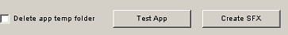

# Easy7zPortable - Generic SFX
 Create portable executables by integrating any emulator easily

<b>Important: Do not take into account the text box and the "Save cfg" button from the DosBox part, in this modified version it is not taken into account, to make it generic.</b>

The original application was intended to create MSDos portables through dosbox, although later I modified it so that any type of executable portable could be created. In the future, I had planned to specifically support more platforms, just as it does now for MSDos (through various tabs in the application itself, in addition to a generic Portable tab that is cleaner than the current one, where I keep the dosbox texts, although not be used to create any kind of executable portable)

# Demo

https://youtu.be/YJm4NRHPjTk

# TO-DO-LIST

* New tabs specific for each type of executable (ZX-Spectrum, Windows, etc ... and 'Others')

# How to use

I recommend before reading the following emezetablog entry, a source of inspiration that I used to decide to create the tool:

http://www.emezeta.com/articulos/crear-portables-sfx-avanzado

Select the folder where everything you need to run the game or application is located. This folder may have other folders, all of which will be compressed for the executable portable:

Select the icon that we want the executable and the game load progression box to have (the display of this dialog box during decompression is actually optional, using the 7z configuration file that we will see later).

<b>Note: If an icon is not selected, it will have the default 7z icon.</b>

Modify the default 7z configuration file to create the executable portable. By default I have included some basic parameters as an initial template, although if you want to have other default parameters to see it differently when starting the tool, it is as simple as modifying it and pressing the “Save cfg” button, then I will detail it the parameters of this configuration file, which must be modified for each game / application before pressing the "Create SFX" button, more information about them, extracted from emezetablog:

 <b>InstallPath</b> = Path where the contents of the self-extractor are decompressed. We use the% TEMP% system variable (it works in Windows 2000, XP, Vista ...) so that it unzips all the content in a folder in the location of the temporary files. Another place could have been chosen, but this is interesting so that even saving the portable file on a CD or DVD will continue to work perfectly and save the saved games on our hard drive.

<b>GUIFlags</b> = Special options. 32 shows the icon in the window. 8 uses XP styles, 4 shows the numerical percentage below the progress bar, etc ...

<b>ExtractTitle</b> = It is used to specify the title of the extraction window.

<b>ExtractDialogText</b> = Shows a text in the extraction window.

<b>ExecuteFile</b> = File to execute once the data extraction finishes.

<b>ExecuteParameters</b> = Parameters from the previous run. In our case, it doesn't show the DosBox debug window.

However, more interesting options and parameters can be used such as previous help messages, a button with a countdown, personalizing the data extraction folders, creating icons for programs or shortcuts, not showing a decompression progression dialog ( it is enough not to include the ExtractTittle and ExtractDialogText) values, etc:

http://7zsfx.info/en/parameters.html

One of them is very interesting is the parameter OverwriteMode = "x", which contrary to what intuition tells us, if it is “1” it is useful so that the files are not overwritten during the extraction, very important to have the possibility of saving games in many games or maintain certain settings that the user has modified to those that have the default application/game.

Select the name that the executable portable will have (without indicating .exe):

Select the destination folder where the executable portable will be created:

Once we have reached this point, we have the possibility to directly create the executable portable using the "Create SFX" button or to test before the game / application works as we wish by pressing the "Test App" button:

The checkbox of “Delete app temp folder”, marked is used so that each time we press “Test App”, the previous folder is deleted beforehand, so that we can test new parameters that we have set.

